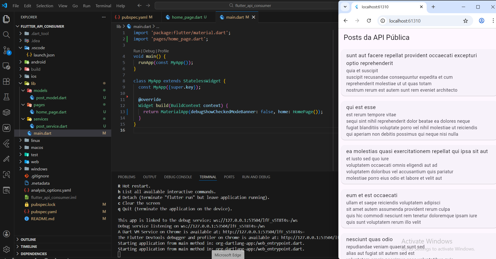
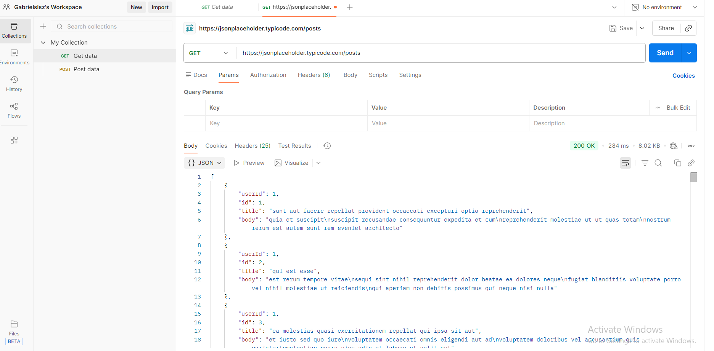

# Flutter API Consumer

Aplicação Flutter desenvolvida para **consumir uma API REST pública**, validada previamente no **Postman**, exibindo os dados em uma interface simples e organizada.

Projeto com foco em **estudo, prática de consumo de APIs e portfólio**.

---

## 📱 Preview da Aplicação

> Print da aplicação Flutter rodando no navegador (Chrome ou Edge):

<!-- ADICIONE O PRINT DO APP AQUI -->


---

## 🌐 API Pública Utilizada

- **JSONPlaceholder**
- Endpoint:
GET https://jsonplaceholder.typicode.com/posts

yaml
Copy code

API gratuita amplamente utilizada para testes e protótipos.

---

## 🧪 Testes da API no Postman

Antes da integração com o Flutter, o endpoint foi testado no **Postman**, validando:
- Status HTTP
- Estrutura do JSON
- Campos retornados pela API

<!-- ADICIONE O PRINT DO POSTMAN AQUI -->


---

## 🛠️ Tecnologias Utilizadas

- Flutter
- Dart
- HTTP package
- Material Design
- Postman (testes de API)

---

## 📂 Estrutura do Projeto

lib/
├── models/
│ └── post_model.dart
├── services/
│ └── post_service.dart
├── pages/
│ └── home_page.dart
└── main.dart

yaml
Copy code

---

## ▶️ Como executar o projeto

1. Clone o repositório:
   ```bash
   git clone https://github.com/seu-usuario/flutter_api_consumer.git
Acesse a pasta do projeto:

bash
Copy code
cd flutter_api_consumer
Instale as dependências:

bash
Copy code
flutter pub get
Execute a aplicação:

bash
Copy code
flutter run
Escolha um dispositivo (recomendado: Chrome)